<!-- ========== CYBERPUNK PROFILE : 4RYAN-sys ========== -->
<!-- Header + all animation lives in assets/banner.svg (an , immune to GitHub sanitizer). -->
<!-- Body below uses only inline style attributes: <style>/<class> blocks are stripped by GitHub. -->

 

<!-- ================= ABOUT / SYSINFO ================= -->

  

    ▚ SYSINFO // PROFILE.JSON
  

<pre style="margin:0; padding:16px 18px; font-family:ui-monospace,'JetBrains Mono','SF Mono',Consolas,monospace; font-size:13px; line-height:1.7; color:#8b949e; text-align:left; overflow-x:auto;">$ cat profile.json
{
  "handle": "4RYAN-sys",
  "role":    "RPL Student :: Fullstack &amp; IoT",
  "focus":   [ "Fullstack Web", "Embedded IoT" ],
  "drive":   "ship small systems that actually work",
  "build":   { "app": "Next.js", "board": "ESP32" }
}</pre>

 

<!-- ================= TECH STACK ================= -->

  

    ▚ STACK // CYBER-PANEL
  

  <table role="presentation" align="center" border="0" cellpadding="0" cellspacing="8">
    <tr>
      <td width="50%" style="border:1px solid rgba(34,211,238,0.18); border-radius:8px; background:rgba(13,17,23,0.55); padding:12px 16px; vertical-align:top;">
        
FRONTEND

        NEXT.JSTYPESCRIPTTAILWINDHTML
      </td>
      <td width="50%" style="border:1px solid rgba(34,211,238,0.18); border-radius:8px; background:rgba(13,17,23,0.55); padding:12px 16px; vertical-align:top;">
        
BACKEND

        NODE.JSPYTHONJAVALARAVELSUPABASE
      </td>
    </tr>
    <tr>
      <td width="50%" style="border:1px solid rgba(34,211,238,0.18); border-radius:8px; background:rgba(13,17,23,0.55); padding:12px 16px; vertical-align:top;">
        
MOBILE

        FLUTTER
      </td>
      <td width="50%" style="border:1px solid rgba(250,204,21,0.25); border-radius:8px; background:rgba(13,17,23,0.55); padding:12px 16px; vertical-align:top;">
        
IOT // EMBEDDED

        ESP32
      </td>
    </tr>
    <tr>
      <td colspan="2" style="border:1px solid rgba(34,211,238,0.12); border-radius:8px; background:rgba(13,17,23,0.4); padding:12px 16px; vertical-align:top;">
        
DESIGN TOOLS

        FIGMACANVA
      </td>
    </tr>
  </table>

 

<!-- ================= MISSIONS / PROJECTS ================= -->

  

    ▚ DIRECTIVES // MISSION LOG
  

  

    

      [ACTIVE] VEDC PKL MANAGEMENT SYSTEM
      &gt; fullstack :: web + db
    

    

      [ACTIVE] OSIS SYSTEM DEVELOPMENT
      &gt; web + org database
    

    

      [QUEUED] IOT SMART LIGHT PROTOCOL
      &gt; esp32 :: embedded
    

  

 

<!-- ================= FOOTER ================= -->

└─ SYSTEM STABLE // UPTIME▸100% :: rebuild quickly, break nothing

