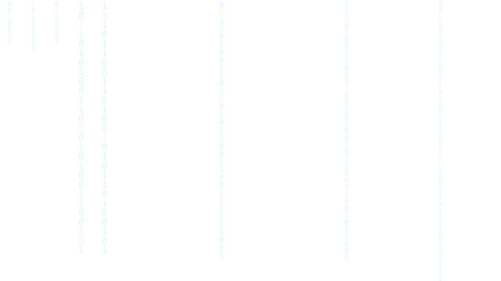

<!-- ========== CYBERPUNK PROFILE : 4RYAN-sys ========== -->

<!-- ================= HEADER ================= -->

  <!-- scanlines -->
  <svg width="100%" height="100%" style="position:absolute; inset:0; pointer-events:none;" aria-hidden="true">
    <defs>
      <pattern id="scan" width="4" height="6" patternUnits="userSpaceOnUse">
        <line x1="0" y1="0" x2="0" y2="6" stroke="#22d3ee" stroke-width="0.5" opacity="0.12"/>
      </pattern>
    </defs>
    <rect width="100%" height="100%" fill="url(#scan)" opacity="0.35"/>
  </svg>

  

    <!-- matrix watermark -->
    

      
    

    

      

        $ whoami --profile
      

      <!-- radar + name -->
      

        <svg width="40" height="40" viewBox="0 0 40 40" aria-hidden="true">
          <circle cx="20" cy="20" r="18" fill="none" stroke="#22d3ee" stroke-width="1" opacity="0.4"/>
          <circle cx="20" cy="20" r="12" fill="none" stroke="#22d3ee" stroke-width="1" opacity="0.4"/>
          <circle cx="20" cy="20" r="6" fill="#facc15" opacity="0.35"/>
          <g>
            <line x1="20" y1="20" x2="34" y2="6" stroke="#22d3ee" stroke-width="1.4"/>
            <circle cx="34" cy="6" r="2" fill="#22d3ee"/>
            <animateTransform attributeName="transform" type="rotate" from="0 20 20" to="360 20 20" dur="3s" repeatCount="indefinite"/>
          </g>
          <circle cx="20" cy="20" r="18" fill="none" stroke="#facc15" stroke-width="1" opacity="0.5"/>
          <circle cx="20" cy="20" r="12" fill="none" stroke="#facc15" stroke-width="1" opacity="0.5"/>
          <animateTransform attributeName="transform" type="rotate" from="0 20 20" to="360 20 20" dur="6s" repeatCount="indefinite"/>
        </svg>
        

          

            4RYAN-sys
          

          

            // system.init() 
          

        

      

      <pre class="cyber-mono" style="margin:16px 0 6px; color:var(--muted); font-size:12px; line-height:1.6;">
┌── AVARITIA :: RPL UNIT ──╼ ▛ INIT ▜
├─▣ mode    :: fullstack + iot
├─▣ shell   :: github-profile v2.1
└─▣ status  :: online [ OK ]</pre>

      

        ▶ TECH-REGION: ID
        ▲ ROLE: STUDENT
        ▣ RPL // VOCATIONAL
      

    

  

<!-- ================= ABOUT / SYSINFO ================= -->

 

  

    ▚ SYSINFO // PROFILE.JSON
  

  <pre class="cyber-mono" style="margin:0; padding:16px 18px; font-size:13px; line-height:1.7; color:var(--muted); text-align:left; overflow-x:auto;">
$ cat profile.json
{
  "handle": "4RYAN-sys",
  "role":    "RPL Student :: Fullstack & IoT",
  "focus":   [ "Fullstack Web", "Embedded IoT" ],
  "drive":   "ship small systems that actually work",
  "build":   { "app": "Next.js", "board": "ESP32" }
}</pre>

 

<!-- ================= TECH STACK ================= -->

  

    ▚ STACK // CYBER-PANEL
  

  <table role="presentation" align="center" border="0" cellpadding="0" cellspacing="8">
    <tr>
      <td width="50%">
        

          
FRONTEND

          NEXT.JSTYPESCRIPTTAILWINDHTML
        

      </td>
      <td width="50%">
        

          
BACKEND

          NODE.JSPYTHONJAVALARAVELSUPABASE
        

      </td>
    </tr>
    <tr>
      <td width="50%">
        

          
MOBILE

          FLUTTER
        

      </td>
      <td width="50%">
        

          
IOT // EMBEDDED

          ESP32
        

      </td>
    </tr>
    <tr>
      <td width="50%" colspan="2">
        

          
DESIGN TOOLS

          FIGMACANVA
        

      </td>
    </tr>
  </table>

 

<!-- ================= MISSIONS / PROJECTS ================= -->

  

    ▚ DIRECTIVES // MISSION LOG
  

  

    

      [ACTIVE] VEDC PKL MANAGEMENT SYSTEM
      > fullstack :: web + db
    

    

      [ACTIVE] OSIS SYSTEM DEVELOPMENT
      > web + org database
    

    

      [QUEUED] IOT SMART LIGHT PROTOCOL
      > esp32 :: embedded
    

  

 

<!-- ================= FOOTER ================= -->

└─ SYSTEM STABLE // UPTIME▸100% :: rebuild quickly, break nothing _

